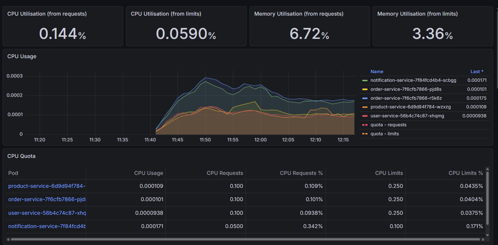
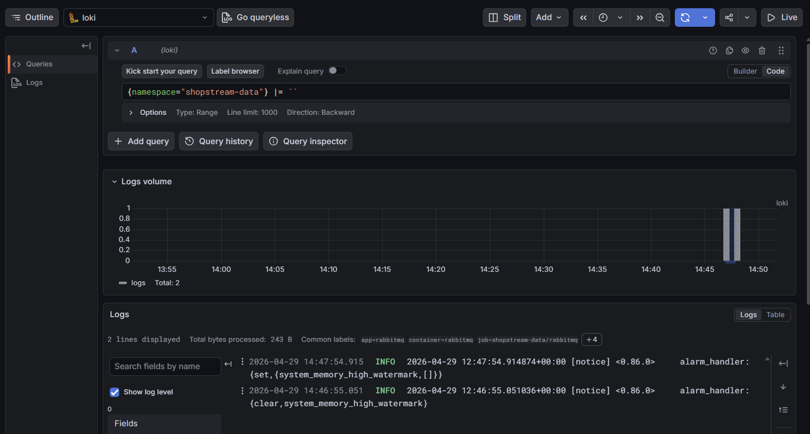

# Kubernetes Complete Project

A hands-on, 9-phase project that teaches Kubernetes end-to-end by building and operating a real microservices system.

No toy examples. No "deploy nginx and call it a day." You build a distributed system with Go microservices, PostgreSQL, Redis, and RabbitMQ — then deploy, scale, monitor, secure, and automate it all on Kubernetes.

## What You Get By The End

A fully working system that:
- Runs 4 microservices communicating over HTTP and async messaging
- Auto-scales under load and self-heals when pods die
- Deploys automatically via GitOps (ArgoCD) when code is pushed
- Has full observability — metrics, dashboards, centralized logs, distributed tracing
- Is secured with RBAC, network policies, pod security, and encrypted secrets
- Manages TLS certificates automatically

The Go code is intentionally simple (single `main.go` per service). The complexity lives in the Kubernetes layer — that's the point.

## Phases

| Phase | Focus | K8s Concepts |
|-------|-------|-------------|
| 1 | Single service + database | Pods, Deployments, Services, ConfigMaps, Secrets, Namespaces |
| 2 | Multi-service + routing | Service Discovery, Ingress, Probes, Resource Limits, Init Containers |
| 3 | Persistent storage + caching | StatefulSets, PV/PVC, StorageClasses, Headless Services |
| 4 | Async messaging | Helm, Jobs, CronJobs, Pod Disruption Budgets |
| 5 | Autoscaling + resilience | HPA, Network Policies, Rolling Updates, Rollbacks |
| 6 | CI/CD + GitOps | Kustomize, ArgoCD, GitHub Actions, Canary Deployments |
| 7 | Observability | Prometheus, Grafana, Loki, Jaeger, DaemonSets, ServiceMonitors |
| 8 | Security hardening | RBAC, ServiceAccounts, Pod Security, Sealed Secrets |
| 9 | Production readiness | Taints/Tolerations, Cluster Autoscaler, cert-manager, Resource Quotas |

## Prerequisites

- Docker
- kubectl
- kind
- Go 1.22+
- Helm

## Quick Start

```bash
# Create a 3-node local K8s cluster
make cluster-create

# Build, load, and deploy everything
make deploy-all

# Access the API
make port-forward
curl http://localhost:8081/health
curl http://localhost:8081/api/products
```

## Project Structure

```
services/               # Go microservices (product, order, user, notification)
k8s/base/               # Kubernetes manifests
docs/                   # Phase guides, architecture, concepts map
  phases/               # Step-by-step walkthrough for each phase
helm/                   # Helm values files
```

## How To Use This

1. **Fork this repo**
2. Start at [Phase 1](./docs/phases/phase-1-foundation.md) and work through each phase in order
3. Each phase guide explains what to do, what K8s concepts you're learning, and why they matter
4. The Go code is already written — your focus is on the Kubernetes manifests and operations
5. Break things on purpose. That's where the real learning happens.

## Screenshots

**Grafana — Kubernetes namespace dashboard (CPU/memory per pod):**



**Grafana — Loki centralized logging:**



## Documentation

- [Why Kubernetes?](./docs/why-kubernetes.md) — The real-world problems K8s solves
- [Architecture](./docs/architecture.md) — System diagram and service interactions
- [K8s Concepts Map](./docs/k8s-concepts-map.md) — Every concept tracked by phase
- [Phase Guides](./docs/phases/) — Step-by-step walkthroughs
- [How It All Connects](./docs/how-it-all-connects.md) — Code → Docker → Kubernetes → CI/CD
- [Cheatsheet](./docs/cheatsheet.md) — kubectl and Helm commands
- [Troubleshooting](./docs/troubleshooting.md) — Common issues and fixes

## Tech Stack

| Layer | Technology |
|-------|-----------|
| Services | Go |
| Database | PostgreSQL |
| Cache | Redis |
| Messaging | RabbitMQ |
| Local Cluster | kind |
| CI/CD | GitHub Actions + ArgoCD |
| Monitoring | Prometheus + Grafana |
| Logging | Loki + Promtail |
| Tracing | Jaeger |
